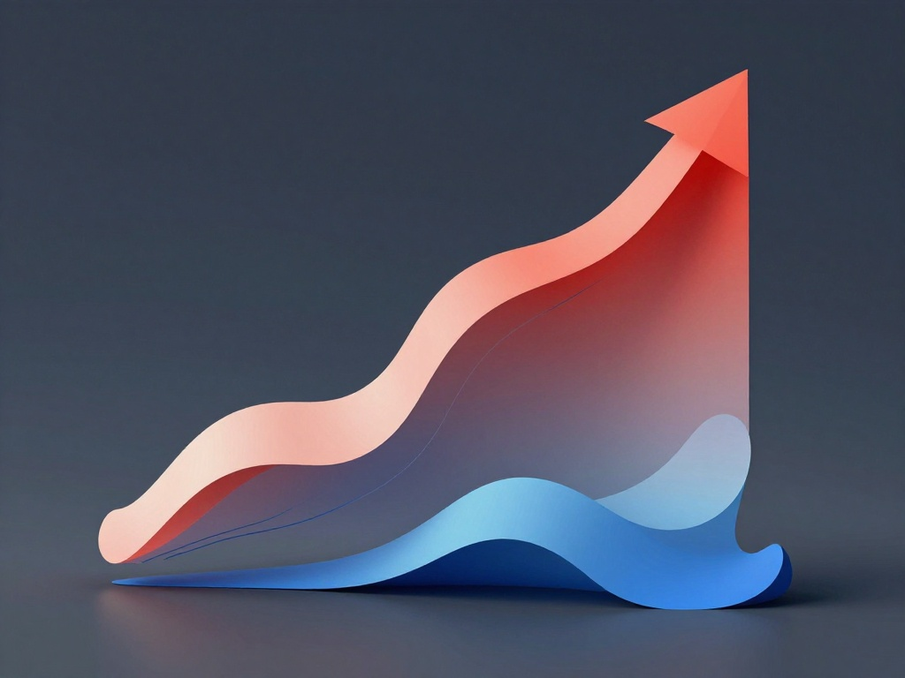
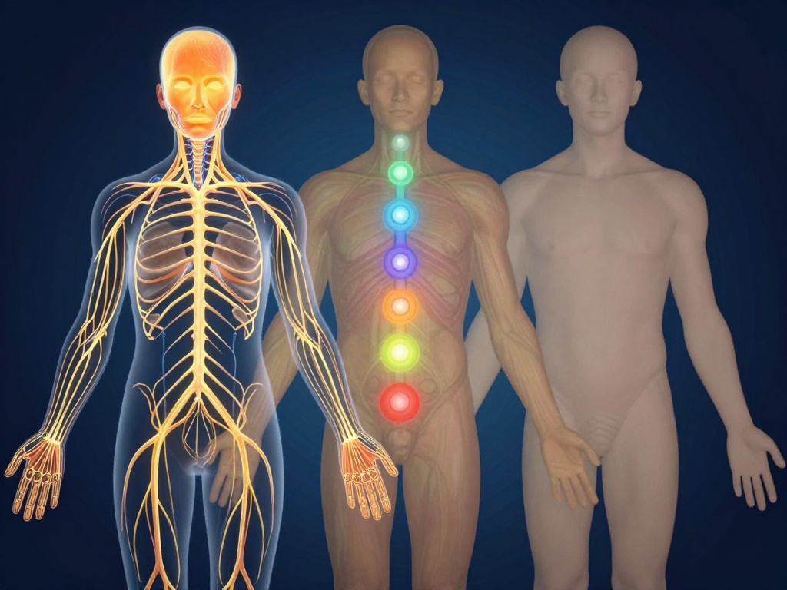

This is copy of [SpiBody 2](https://github.com/tambetvali/SpiZenTao/blob/main/README.md#-tao-spibody-2) in the [README.md](https://github.com/tambetvali/SpiZenTao/blob/main/README.md).

Mostly, because I wanted to draw a logo.

### 🐉 Tao: SpiBody 2

Train your intent. Intent controls your body - matter. Your whole is infinitesimal, a point in infinite field of spirit: like material, independent particles create body in their infinity, and their infinity of response, so the body and it's mind, when repeated the same way, creates our spiritual, mental framework: we, there, in magic mystery, behave like particles.

Spirit is the building block of civilization: each person coming and going, but the spirit high.

To do Zen on your body, let it gain tension for focus and release it for focuslessness of pure zen.

Holistic training means Zen: it's balanced through nerves, muscles and bones. It's balance includes infrequent, non-stressing attention and training on inner organs, with intuitive care or study of safe practice.

Focused training means Warrior: practices which involve strong physical intent, are also practices you do not do often.

#### 🔥 Z: Growth through pain and wear

Negative aspect of training is to sacrifice:
- Pain
- Being physically tired

This sacrifice is made for goals.

Pain can come from initial training, but to get out of pain means training after it's relaxed, in harder cases grown and vitaminized.

Z also means: preparement in this:
- If you only train parts of your body for complete new experience;
  - Based on their position while they can be trainable to various degrees, and this could mean various things; once you have trained new thing somewhere, from zero to something is like billions of percents - this fundamental quality appears everywhere.
  - To start is to create an exponent.

#### 🌿 X: Stable, balanced tonus

This is gaussian curve:
- You can do heavy things sometimes, and extremes rarely. This, in training and your life.
- You can do long process of shallow, holistic training.
  - Holistic means balanced over nerves, bones and muscles, with gaussian sides of time and shared tension on edges for edge goals, and in middle for middle goals.

This is life:
- Long, low-pressure training keeps your intent intact; strong effort removes intent.
- Intent is not mental, but physical force. If it's mental, it's magic: as it happens through your body, your bodies strength matters. This is how body is basing the mind.
- For your everyday goals, you should train them.

X also means: doing:
- It's just slow, relaxed, not forcing too much not even stretching too much.
- Constant stability to make you tired grows stable long-term batteries which are most useful for both everyday life, and your slow spiritual progression.

#### 🌈 Y: Holistic, balanced view

You should use different holistic maps for your body:
- Nerve sensation map: topology shows you feel your hands and fingers the most.
- Chakra map: each chakra has related biological nerves, muscles, bones and organs.
  - Do not forget hands and legs, because they extend chakra map with mental purpose.
- Anatomical default: anatomy shows default sizes.

You can see three modes from Kybalion:
- 1st order integral *is Octave Z*: optimize also the progress, for already stronger muscle or the one you work with, do more training. Spiritually and scientifically, this is known as spiritual gain maximization.
- 1st order differential *is Octave X*: optimize also the risks, for doing more training on weaker muscles. Spiritually and scientifically, this is known as material loss minimization.
- 0th order int / diff solution equals linear system *is Octave Z*: optimize the stability, loss minimizations and gain maximizations you already have.

If you have groups of three goals, try to integrate them. For goals A, B, C, this might be:
- Before optimization, separate plans for A, B, C would need 300% of time, this means 3 units so if you do it 1 hour per day, 1 / 3 would be 1 / 3 - each 100% of progress must be inside 20 minutes.
- For A, B, C, there are united goals which are 50% of each. Finding such goals optimizes it to 150%.
- For pairs A, B; B, C; A, C, there are united goals which unite 25% of what is left in each pair. This cuts the integral down to 75%.
- For each member, simpler model can be found. This is 12.5% of each, 63,375 is left.
- Now: 0,36625 hours, which is 36,625% of 1 hour (100 - 63,375), you could have another similar exercise or practice your creative skills to find, create one or to feel non-comfort, pressure and hardship to shape how you train.

Thus, do not necessarily work on one goal: compare causal and goal-based logic, or Laegna Logecs which is meant for multiparameter optimization through infinities.

Y also means: peaking.
- On less instances, shorter or less frequent exercise, use more intent. This is like partying, but in training.
- Infrequently, do extreme physical efforts. This is like vacations, but in training.

Thus: parties and vacations are good.

### 🔮 Spi

Spi was made from Spiritual, utilizing the cold and more scientifically sounding root "psi", such as psi-force: but turning it into natural process based on evolution and other scientific effects.

It is the prefix which unites my work on spiritual basis, and sounds cold like "business" or "science", because tautologies often come without cognition - it's AI or robot mode; it's tautological model mode for real spirituality, which happens as inside cognition, focus, science and letting go.

